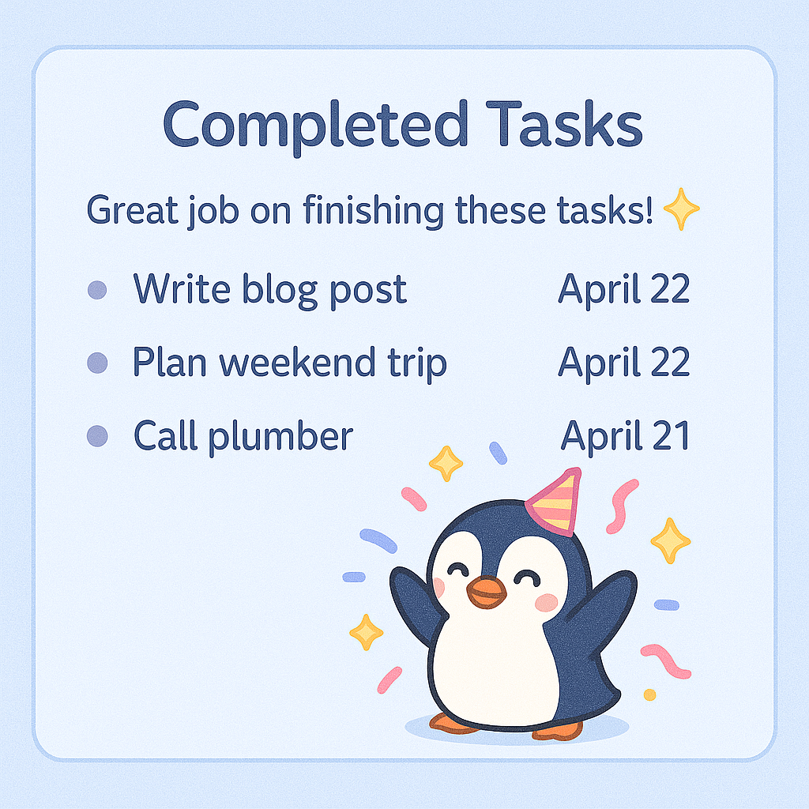

# Discord Task Manager Bot UI Mockups

These are the UI/UX design mockups for the Discord bot project:  
https://github.com/townofnolan/discord-task-manager

- **Theme:** Pastel, soft, cute; penguin (for “My Tasks”), cat (for “Her Tasks”)
- **Target:** Discord-native UIs using embeds, buttons, and modals

---

## 1. Dashboard Overview

**Design Intent:** Project summary, progress, user tasks, with a sleeping cat for warmth and a pastel vibe.


---

## 2. Task List (“My Tasks”)

**Design Intent:** Easy toggle between "My Tasks" (penguin) and "Her Tasks" (cat), clear list with playful accents.


---

## 3. Task Detail/Update

**Design Intent:** View details for a task, mark complete, edit. Soft blue, rounded UI, playful cat accent.


---

## 4. Add Task Modal

**Design Intent:** Discord modal style, soft green, clear fields, penguin by “Assignee”, cat for charm.


---

## 5. Reminders/Deadlines

**Design Intent:** Upcoming reminders, fun pastel with cat, bell emoji, calendar.


---

## 6. Completed Tasks

**Design Intent:** Celebratory penguin, confetti, soft blue, list of completed with dates.



---

## 7. Assign Task

**Design Intent:** Choose “Assign to You” (penguin) or “Assign to Her” (cat). Pastel, both mascots visible.


---

# How to Implement in Discord.js

- Use `EmbedBuilder`, `ButtonBuilder`, and `ModalBuilder` to match these UIs
- Set embed colors to match backgrounds (`#AEE0F9`, `#D8BFD8`, etc)
- Use relevant emojis, and insert mascot images as `.setThumbnail()` or `.setImage()`
- Use Discord buttons and modals for interactivity
- See this chat for code templates, or prompt Copilot:
    - “Generate an embed for the [screen] matching the attached mockup. Use pastel colors, emojis, and insert [cat/penguin] thumbnail.”

# Copilot Prompt Example

```
Here's a mockup for the Task Detail screen: [attach image]
Please generate a Discord.js embed and button set matching the soft pastel design, with a blue background, cat accent, and buttons to mark complete or edit.
```

# Assets

Place all images from this export in your `/assets/ui/` directory and reference them in your code or Copilot prompts.

---

**End of Document**
